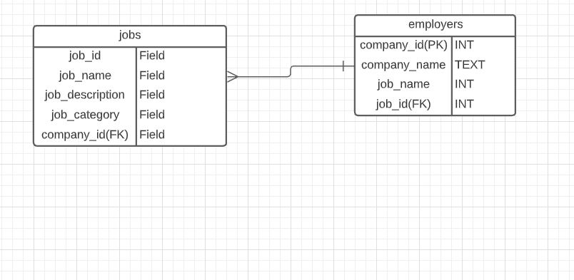

# Jobsboard
This is a job board commited to increasing diversity in the tech industry. The job board aims to connect talented underrepresented individuals to great companies in the tech industry that value equity, inclusion, and dignity for all. Users can click on the jobs link and see a list of jobs . If they click the job title or apply link, they will be directed to a page containing more details about the company and job role. All jobs listed are specifically companies who value diversity on their team. The job list also aims to include opportunities for career pivoters and people looking to break into tech through the addition of internships, apprenticeships, and entry level jobs.

**User stories
---------------------------------------------------------
- **As a user, I want to easily identify links that I can click on to direct me to important parts of the website.**
- **As a user, I want to search for a job, so I can advance my career or change careers.**
- **As a user, I want to be able to see a list of job opportunities, so that I can see what's available**
-**As a user, I want to be able to click the link to apply on the company website or learn more about the company**
-** As a user, I want to be able to post jobs, so that I can hire diverse talent for my company.**

**ERD
-----------------------------------------------------------

**Wireframe
-------------------------------------------------------------

**Tools and Technologies
-------------------------------------------------------------
--Trello for project planning: https://trello.com/b/z2EpG2rD/job-board
--SpringBoot
--Maven
--PostgreSQL
--Baslamiq for wireframes
--LucidChart for erd
--Angular for front end

